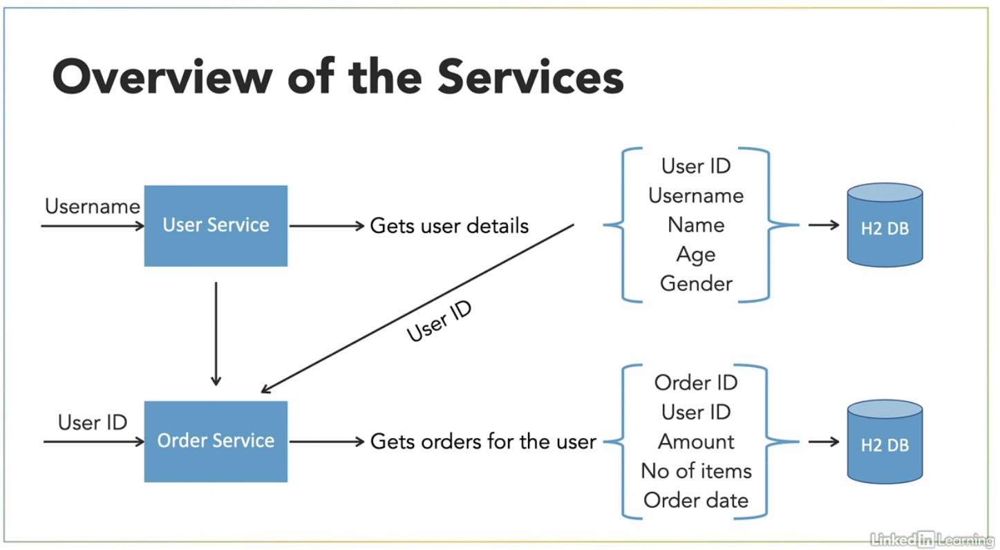
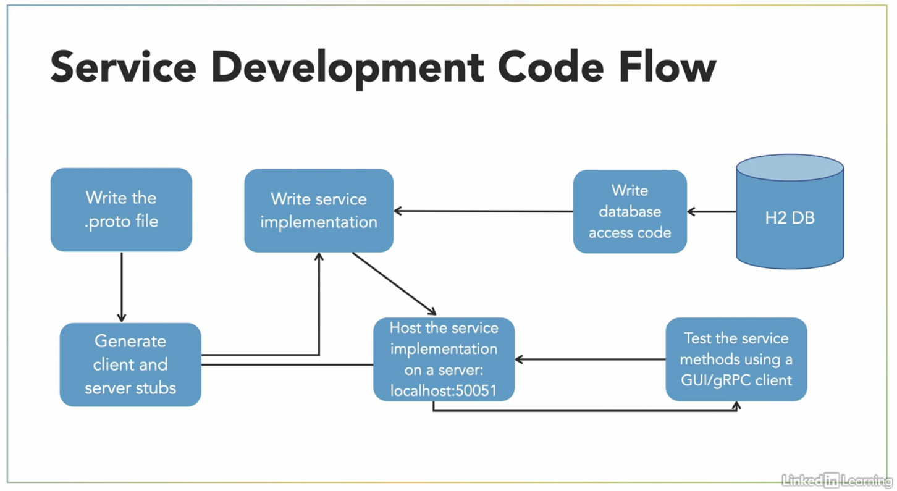
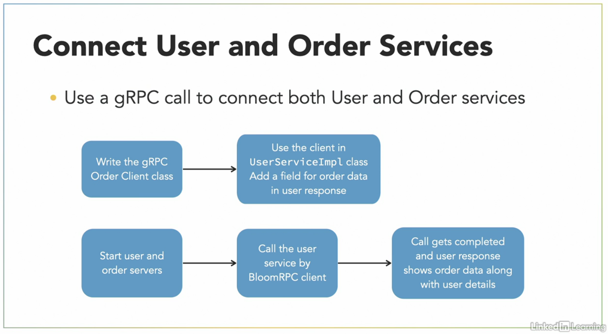

# Project Details

Project for learning GRPC usage through building microservice using Java.

Course Credits : Linkedin Learning

Course Link : https://www.linkedin.com/learning/building-java-microservices-with-grpc

## Services Diagram

## Code Flow

## Orders and User Service Integration Flow

